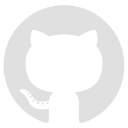
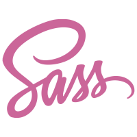

# 

#  Quem sou eu?

Meu nome é Thales Nunes, sou graduado em Design Gráfico e pós graduado em UX Design & Learning Experience e estou agora finalizando minha graduação em Sistemas de Informação pela UEMG.

Após 15 anos de muito comprometimento, acabo de encerrar as minhas atividades como fotógrafo de moda para me dedicar inteiramente a minha nova paixão, a carreira  de desenvolvedor front-end.

Tenho estudado bastante HTML, CSS e Javascript. Além de estar iniciando meus estudos em React.

Na universidade ja tive contato com outras linguagens como C++, C# e recentemente um pouco de Java no Android Studio. Também tive oportunidade de lidar e desenvolver aplicações com banco de dados MySQL.

------

### :rocket: Hard Skills:

Conhecimento de maior interesse:

######   

Ferramentas de Prototipação:

######   

Ferramentas de Versionamento:

######  

Editores:

######  

Conhecimento básico:

######     

Em estudo:

######       :wavy_dash:      :wavy_dash:  

------

### :rocket: Soft Skills:

- Comunicação
- Criatividade
- Resiliência
- Empatia
- Proatividade

------

### :rocket: Conhecimento complementar:

- Design Gráfico
- UX Design
- UI Design
- Familiaridade com metodologia Ágil

------

###  :rocket: Ferramentas complementares:

###### 	    

------

###  :rocket: Contato:

Vamos conversar? 

 [Whatsapp](https://api.whatsapp.com/send?phone=5535997438652) |  [E-mail](mailto:thales.o.nunes@gmail.com)

