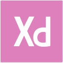

# 

#  Quem sou eu?

Após 15 anos atuando como fotógrafo e gerindo um estúdio focado no segmento de moda, encerrei as atividades em meu melhor momento profissional para me dedicar integralmente à minha transição de carreira e ao meu último ano do curso de Sistemas de Informação, porque amo e acredito muito na tecnologia e no impacto que ela pode ter na sociedade.

Com formação em Design Gráfico e UX Design & Learning Experience, bem como toda minha experiência de mercado lidando com moda e design, tenho uma bagagem bastante visual e, portanto, não tive dúvidas em escolher a carreira de desenvolvedor front-end.

Tenho me dedicado desde o início da faculdade ao aprendizado sólido de HTML, CSS e Javascript, mas tenho bastante interesse também em React e/ou Angular, além de familiaridade com outras tecnologias como Sass, Bootstrap, MySql, Git, GitHub e metodologia ágil de desenvolvimento.

Na universidade ja tive contato com outras linguagens como C++, C# e recentemente um pouco de Java no Android Studio. Também tive oportunidade de lidar e desenvolver aplicações com banco de dados MySQL.

Por toda minha trajetória profissional, liderando grandes equipes, seja na conceitualização ou realização de cada projeto/campanha, desenvolvi ao longo do tempo soft skills que julgo serem importantes para qualquer profissional, como: comunicação, criatividade, resiliência, empatia e proatividade.

Estou em busca de novos desafios.

------

### :rocket: Hard Skills:

Conhecimento de maior interesse:

######   

Ferramentas de Prototipação:

######   

Ferramentas de Versionamento:

######  

Editores:

######  

Conhecimento básico:

######     

Em estudo:

######       :wavy_dash:      :wavy_dash:  

------

### :rocket: Soft Skills:

- Comunicação
- Criatividade
- Resiliência
- Empatia
- Proatividade

------

### :rocket: Conhecimento complementar:

- Design Gráfico
- UX Design
- UI Design
- Familiaridade com metodologia Ágil

------

###  :rocket: Ferramentas complementares:

###### 	    

------

###  :rocket: Contato:

Vamos conversar? 

 [Whatsapp](https://api.whatsapp.com/send?phone=5535997438652) |  [E-mail](mailto:thales.o.nunes@gmail.com)

